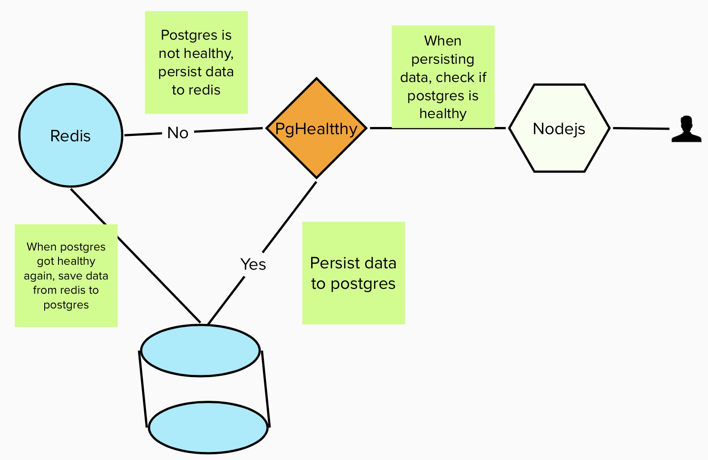

# Message App
## Architecture
User calls the Restful API to manage messages. Messages are stored in postgres database. In this architecture, I added redis to temporary save data in case postgres is unavailable. Once Postgres database is getting healthy, data in redis will be removed and saved in postgres. This new architecture is aimed to have high availability of the message app for data ingestion. 

## Endpoints
The app contains 5 endpoints:

1) Create a message.

```
POST /messages
```
Example
```
{
  "text": "this is not palindrome",
}
```
2) Return list of the messages

```
GET /messages
```
3) Return details about specific message.

```
GET /messages/{id}
```
4) Update a message 

```
PUT /messages/{id}
```
5) Delete a message

```
DELETE /messages/{id}
```

## Database
The database used in this app is Postgres.


## Deploy
Helm charts is used to deploy the message app in a kubernetes cluster.
Follow these steps to deploy the app in k8s cluster:
1) Clone this repo
```
git clone https://github.com/BarhoumiAd/messages.git
```
and change directory to messages. `cd messages`.

2) Run helm install/upgrade

```
helm upgrade --install message --namespace=default  --values helm/message/values.yaml helm/message/
```

## Local development

I have used docker compose for local development, to run the app locally, run the following commands:
1) Instal dependencies
```
npm install
```
2) Spin up message, redis and postgres containers

```
npm run dep_up
```
The script will build and create the message app, spin up a postgres and redis containers. The message app is accessible on `http://localhost:3000`. Use the above endpoints to test the app.

3) Check the services

```
docker ps
```

4) Teardown the services

```
npm run dep_down
```

## Tests

To run the tests, run the following command:

```
npm run test
```
### Coverage
```
  PASS  tests/message.spec.js
  I can
    ✓ add a message with a palindrome text (101 ms)
    ✓ add a message where the text is not palindrome (9 ms)
    ✓ make sure that text is required and not empty string when adding a message (28 ms)
    ✓ get list of messages (7 ms)
    ✓ get details about a message (7 ms)
    ✓ get message with wrong message id! (14 ms)
    ✓ update a message text (24 ms)
    ✓ update a message text with wrong id (11 ms)
    ✓ delete a message (6 ms)
    ✓ delete a message with wrong id (12 ms)
  Database is down, No problem
    ✓ message app still work (41 ms)

---------------|---------|----------|---------|---------|----------------------------
File           | % Stmts | % Branch | % Funcs | % Lines | Uncovered Line #s          
---------------|---------|----------|---------|---------|----------------------------
All files      |   81.23 |    58.39 |    72.3 |   84.39 |                            
 src           |   67.92 |       25 |      50 |   70.58 |                            
  app.js       |   67.92 |       25 |      50 |   70.58 | 44,50-58,80-81,88-89,96-97 
 src/database  |   81.98 |    60.71 |   70.58 |   81.81 |                            
  dbManager.js |    77.1 |    56.52 |   66.66 |   76.82 | 13,65-66,105,111-137       
  setup.js     |     100 |       50 |     100 |     100 | 9                          
  sql.js       |   95.23 |      100 |      75 |   95.23 | 24                         
 src/routes    |   94.44 |    88.88 |     100 |   98.03 |                            
  messages.js  |   94.44 |    88.88 |     100 |   98.03 | 154                        
 src/services  |   73.86 |    48.71 |   63.63 |   79.74 |                            
  cache.js     |   59.57 |       35 |   38.46 |   65.85 | 20,23,26,29,49-55,65-72    
  logger.js    |   90.24 |    63.15 |     100 |   94.73 | 23-24                      
 src/util      |   89.55 |    59.09 |   85.71 |   96.36 |                            
  config.js    |     100 |       50 |     100 |     100 | 3-9                        
  context.js   |   93.75 |      100 |     100 |   92.85 | 20                         
  error.js     |   87.09 |    55.55 |     100 |     100 | 11-16,21-37                
  util.js      |   71.42 |      100 |   33.33 |   83.33 | 10                         
---------------|---------|----------|---------|---------|----------------------------
Test Suites: 1 passed, 1 total
Tests:       11 passed, 11 total
Snapshots:   0 total
Time:        3.797 s, estimated 4 s
```
