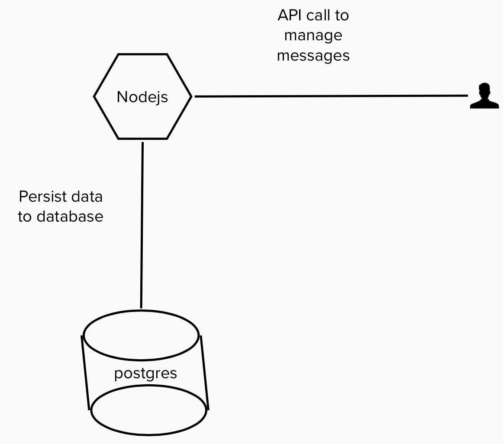

# Message App
## Architecture
User calls the Restful API to manage messages. Messages are stored in postgres database.

## Endpoints
The app contains 5 endpoints:

1) Create a message.

```
POST /messages
```
Example
```
{
  "text": "this is not palindrome",
}
```
2) Return list of the messages

```
GET /messages
```
3) Return details about specific message.

```
GET /messages/{id}
```
4) Update a message 

```
PUT /messages/{id}
```
5) Delete a message

```
DELETE /messages/{id}
```

## Database
The database used in this app is Postgres.


## Deploy
Helm charts is used to deploy the message app in a kubernetes cluster.
Follow these steps to deploy the app in k8s cluster:
1) Clone this repo
```
git clone https://github.com/BarhoumiAd/messages.git
```
and change directory to messages. `cd messages`.

2) Run helm install/upgrade

```
helm upgrade --install message --namespace=default  --values helm/message/values.yaml helm/message/
```

## Local development

I have used docker compose for local development, to run the app locally, run the following commands:
1. Spin up message, redis and postgres containers

```
npm run dep_up
```
The script will build and create the message app, spinup a postgres and redis containers. The message app is accessible on `http://localhost:3000`.

2. Check the services

```
docker ps
```

3. Teardown the services

```
npm run dep_down
```

## Tests

To run the tests, run the following command:

```
npm run test
```
### Coverage
```
 PASS  tests/message.spec.js
  I can
    ✓ add a message with a palindrome text (62 ms)
    ✓ add a message where the text is not palindrome (8 ms)
    ✓ make sure that text is required and not empty string when adding a message (30 ms)
    ✓ get list of messages (8 ms)
    ✓ get details about a message (6 ms)
    ✓ get message with wrong message id! (22 ms)
    ✓ update a message text (19 ms)
    ✓ update a message text with wrong id (15 ms)
    ✓ delete a message (6 ms)
    ✓ delete a message with wrong id (10 ms)

---------------|---------|----------|---------|---------|-------------------
File           | % Stmts | % Branch | % Funcs | % Lines | Uncovered Line #s 
---------------|---------|----------|---------|---------|-------------------
All files      |   85.95 |    58.33 |   88.37 |   89.25 |                   
 src           |   70.83 |       25 |      50 |   73.91 |                   
  app.js       |   70.83 |       25 |      50 |   73.91 | 44,50-58,67-68,74 
 src/database  |    84.7 |    47.36 |     100 |   85.54 |                   
  dbManager.js |   95.65 |    83.33 |     100 |   95.55 | 60-61             
  setup.js     |   85.71 |       50 |     100 |   85.71 | 18-19             
  sql.js       |      64 |    27.27 |     100 |   66.66 | 42-51             
 src/routes    |   94.44 |    88.88 |     100 |   98.03 |                   
  messages.js  |   94.44 |    88.88 |     100 |   98.03 | 154               
 src/services  |    87.8 |    52.63 |   88.88 |    92.1 |                   
  logger.js    |    87.8 |    52.63 |   88.88 |    92.1 | 23-24,34          
 src/util      |   90.62 |    59.09 |   85.71 |   98.07 |                   
  config.js    |     100 |       50 |     100 |     100 | 3-9               
  context.js   |     100 |      100 |     100 |     100 |                   
  error.js     |   87.09 |    55.55 |     100 |     100 | 11-16,21-37       
  util.js      |   71.42 |      100 |   33.33 |   83.33 | 10                
---------------|---------|----------|---------|---------|-------------------
Test Suites: 1 passed, 1 total
Tests:       10 passed, 10 total
Snapshots:   0 total
Time:        2.546 s, estimated 3 s
```
